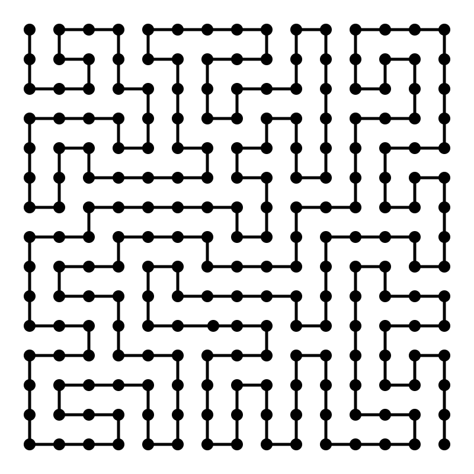

# Self-Avoiding-Walk 

## Description
[Self Avoiding Walk](https://en.wikipedia.org/wiki/Self-avoiding_walk) is a challenge is AI. Base of this code belongs to [Daniel Shiffman](https://github.com/shiffman/The-Nature-of-Code). We will use this code as educational resource (in video series) for optimizing (minimizing time and process) the solution. 

